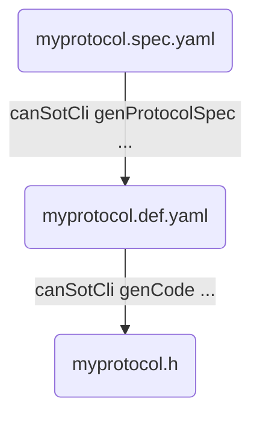

## CAN Sot Cli Tool for Code Generation

To create the `canSotCli` executable, go into your created build folder and run `cmake .. & make canSotCli`.
Now, you get a `canSotCli` executable in your `build` folder.
When you included canSot as a dependency in cmake, the folder where the executable is saved may vary.
For example when using `CPMAddPackage` the `canSotCli` executable is saved in `build/_deps/can-sot-protocol-build`.

This is the general workflow for code generation:



First a `.def.yaml` file is create from the `.spec.yaml`. Here the IDs for all object in the object tree and stream packages are generated and added to the def file. To do this execute:

```bash
build-folder/canSotCli genProtocolSpec --spec-file myprotocol.spec.yaml --output-def-file myprotocol.def.yaml
```

Second, we can generate code for the master and the client from the `.def.yaml` file. The following command will create a single header file for the master. 

```bash
build-folder/canSotCli genCode --master --def-file myprotocol.def.yaml -o src-master/generated/myProtocolMaster.h
```

The header file is then included from the master code, see [example/master-linux/src/main.cpp](../example%2Fclient-linux/src/main.cpp). To generate code for the client just change the flag `--master` to `--client`.


##### CAN Sot Cli Tool - All Arguments

```bash
OPTIONS, ARGUMENTS:
  -?, -h, --help          
                          
  genProtocolSpec         Generate a protocol definition file from a protocol spec file.                     
  -f, --spec-file <file>  The input protocol spec file name.
  -o, --output-def-file <file>
                          The output definition file name.
                          
  genCode                 Generate a code (c++ header file) from a protocol def file.                         
  -?, -h, --help          
  -f, --def-file <file>   The input protocol def file name.
  -o, --output-header-file <file>
                          The output c++ header file name.
  -m, --master            Should the code be generated for the master.
  --client                Should the code be generated for the client.
```


