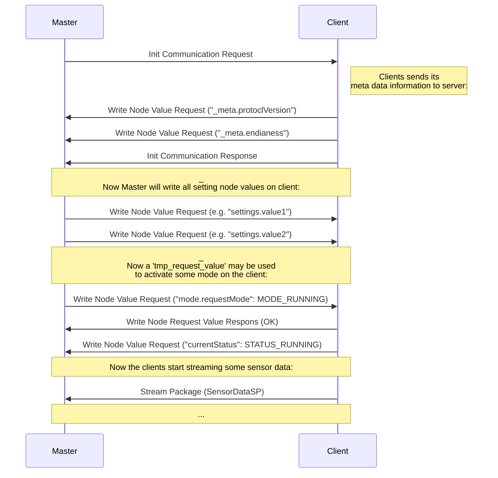

## General Package Structure

The 11 bit CAN ID field and Data of a CAN frame is split into:

| first 5 bit of CAN ID | last 6 bit of CAN ID | 8 Byte Data |
| --------------------- | -------------------- | ----------- |
| Node ID (0-32)        | SOT Message ID       | ...         |

For the Node ID, 0 is reserved to the master, all other ids are for the clients.

CAN Package Direction:

- 🖥️ ➡️ 🎚️️ &ensp; server sends to client
- 🎚️ ➡️ 🖥 &ensp; clients sends to server
- 🖥️ 🔄 🎚️️ &ensp; both client of server can send package to the other part

## General Communication Flow

This is an example for a typical communication flow. Here the client offers a `tmp_request_value` called `mode.requestMode` to activate straming of some sensor data (there is code on the  cilent to do that). This will change the clients `currentStatus` value.

## Control Packages

#### Init Communication Request  &ensp; 🖥️ ➡️ 🎚️

This is the first exchanged message (from master to client).  
After receiving this message, the client will first send all its `_meta` information of the OT to the master (via Write Node Value Requests).
After the client is finished with sending all values in `_meta`, it will respond with a Init Communication Response.

| SOT Message ID (6 bit) | Data 0 byte |
| ---------------------- | ----------- |
| 0b00'0000              |             |

#### Init Communication Response  &ensp; 🎚️ ➡️ 🖥

This is the response of the client to the masters Init Communication Request (from client to master).

| SOT Message ID (6 bit) | Data 1 byte                                                                  |
| ---------------------- | ---------------------------------------------------------------------------- |
| 0b00'0001              | `0` if communication is accepted.  `1` if communication is not accepted. |

#### Communication Error  &ensp; 🖥️ 🔄 🎚

On device sends this to the other device its communicating with to indicate there is a general communication error/problem.

| SOT Message ID (6 bit) | Data 1 byte                                                                                        |
| ---------------------- | -------------------------------------------------------------------------------------------------- |
| 0b00'0010              | `0` Receive Buffer Overflow (other sending device should slow down).  `1` Send Buffer Overflow |

## Object Directory Read / Write

Works in both directions from master to client and the other way.

### Write

#### Write Node Value Request  &ensp; 🖥️ 🔄 🎚️️

| SOT Message ID (6 bit) | Data 1 byte    | Data 1-7 bytes                                |
| ---------------------- | -------------- | --------------------------------------------- |
| 0b00'0100              | Object Node ID | Object Node Value (size depends on data type) |

#### Write Node Value Ack *  &ensp; 🖥️ 🔄 🎚️️

Acknowledge is sent after Write Node Value Request was received (Note, that this is currently not implemented).

| SOT Message ID (6 bit) | Data 1 byte    | Data 0 bytes |
| ---------------------- | -------------- | ------------ |
| 0b00'0101              | Object Node ID |              |

#### Write Node Request Value Response  &ensp; 🖥️ 🔄 🎚️️

When a node value was written (via Write Node Value Request) that is declared as `is_tmp_request_value: true`, this response message is send back by node that received the write request.

| SOT Message ID (6 bit) | Data 1 byte    | Data 1 bytes                                                               |
| ---------------------- | -------------- | -------------------------------------------------------------------------- |
| 0b00'0110              | Object Node ID | `0` if write was accepted by receiver.  `1` if write was not accepted. |

### Read

#### Read Node Value Request  &ensp; 🖥️ 🔄 🎚️️

| SOT Message ID (6 bit) | Data 1 byte    | Data 0 bytes |
| ---------------------- | -------------- | ------------ |
| 0b00'1000              | Object Node ID |              |

#### Read Node Value Response  &ensp; 🖥️ 🔄 🎚️️

Response is sent after Write Node Value Request was received.

| SOT Message ID (6 bit) | Data 1 byte    | Data 1-7 bytes                                |
| ---------------------- | -------------- | --------------------------------------------- |
| 0b00'1001              | Object Node ID | Object Node Value (size depends on data type) |

## Stream Packages

#### Stream Package  &ensp; 🖥️ 🔄 🎚️️

| SOT Message ID (6 bit)        | Data 1 byte    | Data 1-7 bytes                                |
| ----------------------------- | -------------- | --------------------------------------------- |
| Variable SP Id (value: 16-64) | Object Node ID | Object Node Value (size depends on data type) |